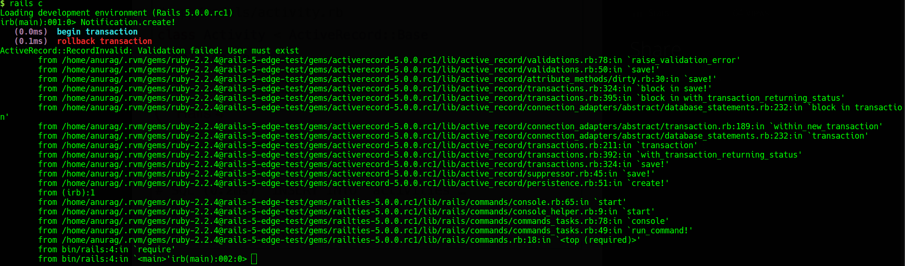
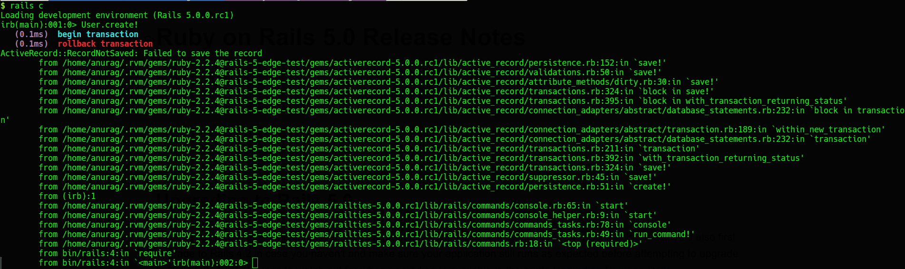
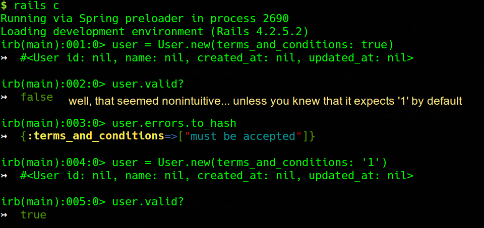

# Require `belongs_to` by default.

Added in [PR#18937](https://github.com/rails/rails/pull/18937)

> When you generate a new rails5 application, it generates a new initializer file `config/initializers/active_record_belongs_to_required_by_default.rb`.


>This file has a single configuration
```ruby
Rails.application.config.active_record.belongs_to_required_by_default = true
```
Let's see how this particular option affects the default behavior of the belongs_to association in a rails5 app.

#### Example

Consider a simple belongs_to association between a User and Notification model.

```ruby
# In case of rails 4 it would inherit from ActiveRecord::Base.
# Otherwise same.
class User < ApplicationRecord
end

class Notification < ApplicationRecord
  belongs_to :user
end
```

#### The rails4 scenario.

In Rails4, If we try to persist an object with an invalid owner, it would not raise any errors.

Therefore, the below snippet worked


###### Wished the framework did it for me.. After all, rails is all about sensible defaults.

As you would realize that for most of the times in a belongs_to association, we would need an owner to be present.

However, till rail4, we had to specify an option of `required: true` in the `belongs_to` association.

No longer sounds like `the awesome rails territory`.. does it ?


#### The rails5 scenario

*Rails5 brings the sanity of sensible defaults back to the belongs_to association !*

Off course, if we want to make the owner optional, we can turn this off on a  per-association basis with `optional: true`



###### Note: Like most of the other new defaults, this new default only applies to new Rails apps that will be generated with an initializer to set the related configuarions.

---

# Explicit halting of callback chains

Added in [PR#17227](https://github.com/rails/rails/pull/17227)

> When you generate a new rails5 application, it generates a new initializer file `config/initializers/callback_terminator.rb`.


>This file has a single configuration
```ruby
ActiveSupport.halt_callback_chains_on_return_false = false
```
Let's see how this particular option affects the default behavior of the callback_chains.

#### Example

Consider a model which have a `before_create` which returns false

```ruby
class User < ApplicationRecord
  # In case of rails 4 it would inherit from ActiveRecord::Base.
  # Otherwise same.
  before_create :do_something_and_return_false

  private
    def do_something_and_return_false
      throw :abort
    end
end
```

#### The way it worked in rails4

When a `before` callback returns `false` in ActiveRecord, ActiveModel and ActiveModel::Validations, then the entire callback chain is halted.

In other words, successive 'before' callbacks are not executed, and neither is the action wrapped in callbacks.

**But that was not a good idea**

As explained by DHH [here](https://groups.google.com/d/msg/rubyonrails-core/mhD4T90g0G4/cFbYuguL0rUJ), that behavior could have resulted in unintended halt in the callback chain if any before callback returned false.

Here's how the above example works in rails4


#### The way it works in rails5

> In Rails 5.0, returning false in a callback will not have the side effect of halting the callback chain.


###### The recommended way to halt callback_chains is throw(:abort)

Here's how you do it in rails5

```ruby
class User < ApplicationRecord
  before_create :do_something_and_return_false

  private
    def do_something_and_return_false
      throw :abort
    end
end
```
Let's verify by trying to create a new user.



> As per [DHH's comment](https://github.com/rails/rails/pull/17227#issuecomment-59449385), halting the callback chain on after_ callbacks is definitely on the list but is still a work in progress.

###### Note: Like most of the other new defaults, this new default only applies to new Rails apps that will be generated with an initializer to set the related configuarions.

---

# Allow '1' or true for acceptance validation.

Added in [PR#18439](https://github.com/rails/rails/pull/18439)

> Rails5 changes the default accept from "1" to ["1", true]. Allowing you to specify an **array of options**.
>
It supports single values as well for backwards compatibility.

#### Example

Consider a model that validates acceptance of terms_and_conditions

```ruby
class User < ActiveRecord::Base
  # In case of rails 5 it would inherit from ApplicationRecord.
  # Otherwise same.
  attr_accessor :terms_and_conditions
  validates :terms_and_conditions, acceptance: true
end
```

#### The way it worked in Rails4

Until Rails4, the default accept value was '1' which was counter intuitive at best.

Although, we could pass an :accept option, which determines the value that will be considered acceptance, but again, that was a single value.

Now, What if we wanted to allow any of a given set of values as acceptance e.g. ['true', 'TRUE', 'True']... well, certainly a pain in some part of anatomy to write custom validators for these trivial scenarios !




#### The way it works in rails5

Rails5 makes it more intuitive by changing the default accept from "1" to ["1", true]. **Allowing you to specify an array of options.**

It supports single values as well for backwards compatibility.


---
